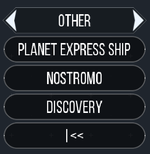
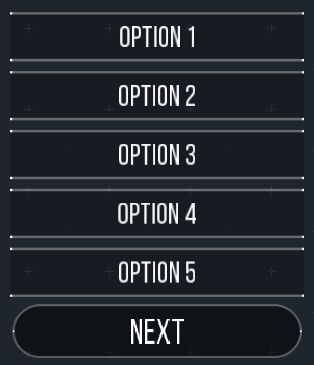

:attribute-missing: warn
:attribute-undefined: drop
:source-highlighter: coderay

:toc: left
:toclevels: 2
:icons: font

:revremark: Work in Progress

= Lively Epsilon

WARNING: This document is Work in Progress. The given information should be correct, but some things are still missing.

== Introduction

TODO: functional approach

If you want to use the framework you should already be familiar with writing missions
for EE.

== Getting Started

Checkout this repo into the ``scripts`` folder of your EE installation or just download the zip from
Github and extract.

[source,lua,indent=0]
----
include::examples/01_getting_started_spec.lua[tag=getting-started]
----

If you like, you can still put code into the `update` function, but typically you do not
need to do that, because Lively Epsilon is using `Cron` to perform checks and updates that
you would usually put there. Your code usually ends up in the `init` function.

If not indicated otherwise all example code will have to be put into the `init` function.

== Building Blocks

=== Cron

`Cron` works as a scheduler for functions. It is capable of calling functions after a specified
time and calling functions regularly at a specified interval. This is what you typically do
in the `update` function, but you are more flexible and you can configure how often your
function should be called.

==== regular

Basic usage::
[source,lua,indent=0]
----
include::examples/02_cron_spec.lua[tag=regular]
----

If you got an operation that is expensive or does not make sense to execute too often you can
give an interval.

A check that is done once a second::
[source,lua,indent=0]
----
include::examples/02_cron_spec.lua[tag=regular-interval]
----

There is an optional third parameter that gives the initial delay. This specifies how many seconds
after creation the function is called for the first time.

==== once

Basic usage::
[source,lua,indent=0]
----
include::examples/02_cron_spec.lua[tag=once]
----

==== aborting crons

It is possible to abort crons from within and outside the function.

The callback function gets itself as the first parameter. It can be used to abort the currently
running cron.

[source,lua,indent=0]
----
include::examples/02_cron_spec.lua[tag=abort-inside]
----

You could also decide to give your cron a fixed name. This way you can stop the cron from anywhere.

[source,lua,indent=0]
----
include::examples/02_cron_spec.lua[tag=abort-outside]
----

NOTE: A cron will be overridden if one by the same name already exists. This is intended behavior.
So you need to make sure that your name is unique.

To prevent colliding names `Cron` returns a unique one for you if none is given. You can also
use that to stop a different cron.

[source,lua,indent=0]
----
include::examples/02_cron_spec.lua[tag=abort-outside2]
----

==== Measuring time

Empty Epsilon does not give any guarantee on how many frames are rendered per second. You need
to keep that in mind when working with time.

===== delta

You get a delta as the second argument or the callback function. This is always the
time that passed since the callback was called the last time or – if it is called for the first
time – since it was created.

Here is a simple way to have nanobots repair your ships hull.

Implementing nanobots::
[source,lua,indent=0]
----
include::examples/02_cron_spec.lua[tag=delta]
----

===== now

You can get the current game time in game in seconds using `now()`

[source,lua,indent=0]
----
include::examples/02_cron_spec.lua[tag=now]
----

WARNING: This is a rough time and will probably diverge with the time of the clock on your wall.

===== manipulate delays

You can manipulate delays to postpone their execution using `addDelay`.

[source,lua,indent=0]
----
include::examples/02_cron_spec.lua[tag=add-delay]
----

You can also read the time that has to pass until the function is called for the next time with `getDelay`.

[source,lua,indent=0]
----
include::examples/02_cron_spec.lua[tag=get-delay]
----

=== EventHandler

An EventHandler is a well-known concept from programming that allows to loosely couple your code.
You can have several independent functions listening to the same event, but they do not need to
know or even care about one another.

The terminology is that a function "registers" to listen for an event and is called as soon
as the event is "fired".

[source,lua,indent=0]
----
include::examples/03_event_handler_spec.lua[tag=basic]
----

In the example the cron at the bottom has just one job: Recreating the player ship if it got
destroyed. All the other logic that happens afterwards is done in the event listeners.

You can see in the example that you can give a single argument to the `fire` method that will
be passed through to the event listeners.

[CAUTION]
=====
You need to be aware that the argument is given to the event listeners **by reference**.
This means that all changes you do to that parameter are permanent and available in successive
event listeners.

You can use that to your advantage. But you should be aware that you alway need to check your inputs.
=====

==== config.allowedEvents

The problem with the event names is that you could mistype some of them. This leads to confusion because
you _have_ set the event listener, but it will never be called.

This is why the `allowedEvents` config exists. You can use it configure a list of event names that
are known to be correct. If you try to register or fire an event with a name that is not in that list
it will fail with an error.

[source,lua,indent=0]
----
include::examples/03_event_handler_spec.lua[tag=allowed-events]
----

==== config.unique

By default you can call events as often as you like, but if you want to use one event handler for
running your main story, the `unique` config option might come in handy.

It guarantees that every event is only called once and issues warnings if a listener is registered
after the event is called or if an event should be called a second time.

[source,lua,indent=0]
----
include::examples/03_event_handler_spec.lua[tag=unique]
----

==== priorities

By default all events are called in the order they have been registered. Typically it is
a good rule of thumb to write Event Listeners in a way that their order does not matter,
but in some cases there is no easy way around. That is why you can specify a `priority` when
registering an event. The default value is `0` and the lower the number is the earlier
the listener is called.

[source,lua,indent=0]
----
include::examples/03_event_handler_spec.lua[tag=priority]
----

=== Translator

The Translator helps you writing your scenarios independent of the players spoken language.
You can `register` translations for labels and then `translate` them.

[source,lua,indent=0]
----
include::examples/04_translator_spec.lua[tag=basic]
----

Translations can also be functions. They will be called with the additional parameters
that are given to the `translate` method.

[source,lua,indent=0]
----
include::examples/04_translator_spec.lua[tag=function]
----

TIP: When working with functions it is always advised to think of them as _atomic functions_.footnote:[
This means they should only operate on the parameters given and not manipulate them.] Having helper functions
extracted is of course fine. But they should not include business logic or have to anything about global state.

TIP: Missing labels or failing translation functions will not break the business logic of your
code. They will return the translation key. This is to ensure that a scenario does not fail in
one locale but not the other because a translation is faulty.

==== multiple locales

So far we have only used one locale. There is a default locale that has the identifier "en" for some
mysterious reason. All translations are registered and translated from "en" unless you give a different key
as the first argument.

You can use the `useLocale` function to change the default locale when the `translate` method is called.

[source,lua,indent=0]
----
include::examples/04_translator_spec.lua[tag=languages]
----

`useLocale` can also use fallback locales in case there is no label in the given locale.

[source,lua,indent=0]
----
include::examples/04_translator_spec.lua[tag=fallbacks]
----

== Components

=== OrderQueue

The OrderQueue Component allows to chain commands for Ships and <<fleet, Fleets>>. So instead of
giving just one order, you can issue multiple orders that are executed consecutively.

This makes it easy to issue complex commands or define patrol routes.

[source,lua,indent=0]
----
include::examples/31_order_queue_spec.lua[tag=basic]
----

As with other orders issued to Fleets, they will carry out the order even if the Fleet Leader was destroyed.

TIP: As GM you can issue different commands to ships with an active OrderQueue. They will follow your command and take
on they reached their objective or you reset them by giving them the order to idle.

Every `Order` allows you to specify the three callbacks `onExecution`, `onCompletion` and `onAbort` as optional
configuration. They get the order as first argument and the `Ship` or `Fleet` executing the order as second
parameter.

`onAbort` is called when the current order can no longer be executed. This can happen if a ship is ordered to
dock at a station, but the station is destroyed. It gets the `Ship` or `Fleet` as third parameter and a string
with the `reason` as second argument.

Every `Order` can also have an `delayAfter` configuration. It waits the specified amount of seconds before
executing the next `Order` after completing the current order.

Using the callbacks it is rather easy to let a ship patrol between two points::
[source,lua,indent=0]
----
include::examples/31_order_queue_spec.lua[tag=loop]
----

==== flyTo

Makes a ship fly to a specific coordinate.

[source,lua,indent=0]
----
include::examples/31_order_queue_spec.lua[tag=flyTo]
----

As configuration you can set a `minDistance`. This sets the radius that the ship should be around the
target zone so the `Order` is considered done.

If `ignoreEnemies` is set to `true` the ship will not attack enemies on the way to the target location.

Read more on this topic in the link:reference.html#order-flyto[Reference] and the link:spec.html#order-flyto[Specification].

==== dock

This order makes a `Ship` or `Fleet` dock to a station, refill its weapons, recharge its shields and repair any hull damage.

[source,lua,indent=0]
----
include::examples/31_order_queue_spec.lua[tag=dock]
----

Read more on this topic in the link:reference.html#order-dock[Reference] and the link:spec.html#order-dock[Specification].

==== attack

This lets a `Ship` or `Fleet` attack a target until it is destroyed.

[source,lua,indent=0]
----
include::examples/31_order_queue_spec.lua[tag=attack]
----

Read more on this topic in the link:reference.html#order-attack[Reference] and the link:spec.html#order-attack[Specification].

==== defend

Let a `Ship` or `Fleet` defend a location, a target or the current location.

[source,lua,indent=0]
----
include::examples/31_order_queue_spec.lua[tag=defend]
----

The configuration can tweak the Order. The Ship will consider the task complete when there are no enemies
in `range` for the last `minClearTime` seconds.

NOTE: This does not mean that the ship will attack those enemies in `range`. It is still the AI that will
take care of target selection.

The configuration option `minDefendTime` gives the time that the ship will defend the location even if there
have never been enemies anywhere around.

Read more on this topic in the link:reference.html#order-defend[Reference] and the link:spec.html#order-defend[Specification].

==== use

Make a `Ship` or `Fleet` take a WormHole. This is rather straight forward for ships, but the behavior is
more complex for ``Fleet``s. The ships will jump to the target on their own, but wait on the other side
until all ships have arrived.

[source,lua,indent=0]
----
include::examples/31_order_queue_spec.lua[tag=use]
----

There is a point right in front of the WormHole, where the ships will break up their formation to fly into the
WormHole. The configuration callback `onBreakUp` will be called at that moment.

Read more on this topic in the link:reference.html#order-use[Reference] and the link:spec.html#order-use[Specification].

=== Comms

The `Comms` Component allows to describe communication screens.

[source,lua,indent=0]
----
include::examples/30_comms_spec.lua[tag=basic]
----

`setHailText` sets the text the ship or station "says" when the player contacts them. With `addComms` you
can add new Replies that the players can click. `Comms:newReply` takes three arguments – only the first one
is mandatory. The first argument is the Label (aka "the thing the players say"), the second a `Screen` that
will be shown when this reply is selected. If you leave the second argument out the main screen will be shown
when this reply is selected. The third argument is a function that gets the `Comms`, the hailed `ship` and the `player`
as arguments and should return `true` if this reply should be displayed.

The first two arguments can also be functions::
[source,lua,indent=0]
----
include::examples/30_comms_spec.lua[tag=reply-functions]
----

The `Comms:newScreen` function allows you to create nested communications. Here is a complex snippet
to create a "Guess a number" game in comms

[source,lua,indent=0]
----
include::examples/30_comms_spec.lua[tag=guess-my-number]
----

Read more on `Comms:newScreen` and `Comms:newReply` this topic in the link:reference.html#comms-newreply[Reference] and the link:spec.html#comms-newreply[Specification].

=== Comms.storyComms

// === Narrative

=== Menu

The Menu is a powerful component to build menu-like structures using the custom buttons that
can be added through the API. It can be used to create sub-menus and paginate long lists of buttons
making it feasible to have a dynamic number of buttons.

[source,lua,indent=0]
----
include::examples/30_menu_spec.lua[tag=basic]
----

NOTE: The menus do not live-update. The list of close ships does not automatically update without
player interaction. They need to go back to the main menu and click the "Ships" button again to
see an updated list of ships.

==== Back Button

The Menu Component will _always_ add a back button (``|<<``) to submenus that leads to the main menu.
This is to prevent a dead-lock situation where the player is not able to return to the main menu, because
a submenu does not have a back button.

You can change the label of the back button for all menus by using the `backLabel` configuration:

[source,lua,indent=0]
----
include::examples/30_menu_spec.lua[tag=back]
----

==== Sorting

By default the menu entries are sorted by the order they are added to the menu. But you can set
a priority on the menu items. Their default priority is `0`. Setting a lower number will move the item
to the top, a higher number will move it to the bottom.

[source,lua,indent=0]
----
include::examples/30_menu_spec.lua[tag=priority]
----

==== Pagination

Long menus are automatically paginated to prevent the buttons from overflowing the screen.

[source,lua,indent=0]
----
include::examples/30_menu_spec.lua[tag=pagination]
----

The Menu Component tries to play nicely with custom buttons that have been added to the stations
without the Menu Component. They will always stay visible, but as they reduce the slots that the
menu component can utilize you should set the `itemsPerPage` configuration to a lower number. It
determines how many slots the Menu Component is allowed to fill at most per station.

You can also change the labels of the "Next" and "Previous" buttons.

[source,lua,indent=0]
----
include::examples/30_menu_spec.lua[tag=pagination-configuration]
----

==== Menus for GM

=== Missions

==== Mission Brokers & Comms

==== Missions for Players

==== Mission Tracker & Display

==== Mission Display

=== Upgrade

==== Upgrade Broker & Comms

==== Upgrade Tracker & Display

[[playerspaceship-storage]]
=== PlayerSpaceship Storage

==== Storage Tracker

=== Crew

// stationen und special für ship

=== Ship Events

[[fleet]]
=== Fleet

A Fleet allows to group ships together and let them fly in formation.

Via scripts you can issue orders to fleets. If the fleet leader is destroyed the next ship will
pick up the lead and continue executing the given order.

This works the same way when the GM gives orders to the leader ship. If the leader is destroyed
the next ship will take over the order.

TIP: As GM you can issue different orders to the wingmen. They will execute these
until you give them the `orderIdle` and they will fly back in formation.

[source,lua,indent=0]
----
include::examples/20_fleet_spec.lua[tag=basic]
----

[[tags]]
=== Tags

Tags are a generic concept to apply to any object. You can add and remove tags without the need of
adding multiple attributes.

[source,lua,indent=0]
----
include::examples/21_tags_spec.lua[tag=basic]
----

It works with any object.

[source,lua,indent=0]
----
include::examples/21_tags_spec.lua[tag=object]
----

=== Products

A product is a representation of something that can be bought, sold, produced or loaded and is used in multiple
places in Lively Epsilon.

It is fairly easy to create a new product.

[source,lua,indent=0]
----
include::examples/40_product_spec.lua[tag=basic]
----

The size is of a product is only used for tracking the storage space need in a `PlayerSpaceship`. Bigger items
should have a bigger size.

Everything apart of the name is optional to make it easy to create unique products.

[source,lua,indent=0]
----
include::examples/40_product_spec.lua[tag=mission-item]
----

Read more on Products in the link:reference.html#product[Reference] and the link:spec.html#product-new[Specification].

=== Storage

There are two concepts for defining storage inside Lively Epsilon. This describes the one that is used for
non-player ships. You can imaging the concept as "storage rooms": For every product there is a storage room
for this product only. If the station can not store any more of product `A`, it can still store product `B`,
because there is a different storage room for it.

This concept is also used for non-player spaceships.

Using the `withStorageRooms` function lets you define the maximum storage capacity.

[source,lua,indent=0]
----
include::examples/41_storage_spec.lua[tag=basic]
----

NOTE: Modifying a product storage beyond its minimum or maximum capacity does not cause any kind of error.
It will just create products out of thin vacuum or make products disappear in an invisible pocket-sized black hole.
This is to ease scripting for you and not having to take care of multiple error conditions.

Read more on Storage in the link:reference.html#shiptemplatebased-withstoragerooms[Reference] and the link:spec.html#shiptemplatebased-withstoragerooms[Specification].

=== Production

Stations with a storage can transform products into other products or even create products from nothing
(like solar energy) or convert products into nothing (like used up energy).

[source,lua,indent=0]
----
include::examples/42_production_spec.lua[tag=basic]
----

The station will continue producing unless there are not enough resources or the storage of the product is full.

Combining this with the Merchant can help you create a simple economy that the players can help running.

Read more on Production in the link:reference.html#station-withproduction[Reference] and the link:spec.html#station-withproduction[Specification].

=== Merchant & Comms

Having a storage is of course in itself not useful, but stations can have a merchant
that buys or sells goods.

[source,lua,indent=0]
----
include::examples/43_merchant_spec.lua[tag=basic]
----

Configuring ``buyingLimit`` and ``sellingLimit`` is optional. If left blank the station
will sell and buy all of its stock. In any other case it will only sell if it got
more than ``sellingLimit`` units in store and buy if it got less than ``buyingLimit`` units
in store.

Configuring the merchant will allow any non-enemy ship (including the player) to
buy or sell from the station.

Read more on Merchants in the link:reference.html#station-withmerchant[Reference] and the link:spec.html#station-withmerchant[Specification].

==== Merchant Comms

=== Traders

A trader is assigned to one station and buys one resource on behalf of the station from a different station.
So what you need is a station that sells some product, a station that buys that product and a trader assigned to
the second one.

[source,lua,indent=0]
----
include::examples/44_trader_spec.lua[tag=basic]
----

This trader will try to find a station close to its home base ``buyer`` that sells power, buy it and bring
it back to its home station.

NOTE: Unlike economist nowadays, traders in Lively Epsilon are not trying to maximize their profits. They
will just buy anything regardless of its price.

Read more on Traders in the link:reference.html#ship-behaveasbuyer[Reference] and the link:spec.html#ship-behaveasbuyer[Specification].

=== Miner

A miner is a ship that will seek out Asteroids close to its home base, mine them and
unload the products at its home base.

[source,lua,indent=0]
----
include::examples/45_miner_spec.lua[tag=basic]
----

Using the callback you can determine which resources the miner finds when it has mined an asteroid. Products
the ship or its home base can not store will be silently discarded.

Read more on Miners in the link:reference.html#ship-behaveasminer[Reference] and the link:spec.html#ship-behaveasminer[Specification].

=== Chatter

Chatter is a component to wrap ambient noise and limit its range. You would typically not use it to relay
important information to the players but make the surrounding appear more alive. They will pop up in the log
of the `Relay` station. By default the range that Chatter is received is `1.5` times the radar range, but you
can change it with the `maxRange` option.

[source,lua,indent=0]
----
include::examples/50_chatter_spec.lua[tag=basic]
----

You typically do not need more than one `Chatter` object in your scenario. Except when you want to relay different
conversations at different distances.

The Chatter component is also able to send conversations.

[source,lua,indent=0]
----
include::examples/50_chatter_spec.lua[tag=converse]
----

Every line of the conversation will be send with a slight delay depending on how long the actual line was.
It should roughly match the reading speed of an average person. If one of the partners is destroyed, the
conversation will be aborted. And if one the partners is out of range the players will just read part of the
conversation.

Read more on Chatter in the link:reference.html#chatter-new[Reference] and the link:spec.html#chatter-new[Specification].

==== Chat Noise & Chat Factory

Chat Noise is a concept to allow random chats around the universe that is not triggered by certain actions
but randomly occurring to keep the players engaged. You can use it to entertain the crew or hide secret
messages in it.

You can add multiple `ChatFactories` to `ChatNoise` that describe chats that the player could randomly
receive at certain intervals. Chats could only be run if there are a certain amount of `Stations` and `Ships`
close to the player.

Let's start with a simple example by adding only one `ChatFactory` to our `ChatNoise`

[source,lua,indent=0]
----
include::examples/50_chatter_spec.lua[tag=noise-intro]
----
<1> The first parameter (`1`) denotes that the function expects one valid station or ship.
<2> The return value is a valid object to be used as argument for the `converse` function.

`ChatterNoise` selects a random `CpuShip` or `SpaceStation` in the vicinity of the player and gives
it as argument to the function.

It is also possible to have multiple participants in a conversation. This will select two distinct ``CpuShip``s
or ``SpaceStation``s and give it as arguments to the function.

[source,lua,indent=0]
----
include::examples/50_chatter_spec.lua[tag=noise-two]
----

To have more control over what is selected as arguments you can use the `filter` option and have a function
that returns `true` if the given argument is a valid candidate for the `ChatFactory`.

[source,lua,indent=0]
----
include::examples/50_chatter_spec.lua[tag=noise-filter]
----
<1> filter functions get all other selected arguments as additional arguments in inverse order.

This chat would only run if there are a `CpuShip` and a friendly `SpaceStation` close to the player.

Read more on ChatterNoise and ChatterFactory in the link:reference.html#chatter-newnoise[Reference] and the link:spec.html#chatter-newnoise[Specification].

== Development

=== Logging
